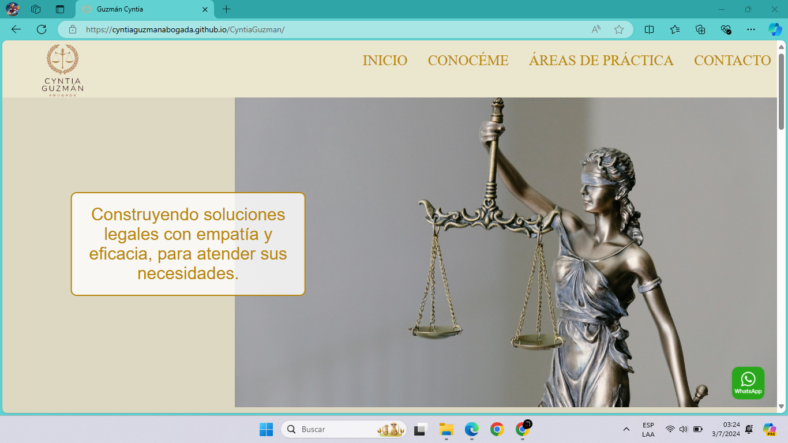
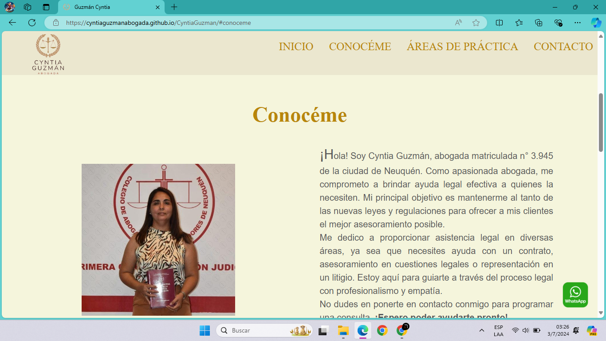
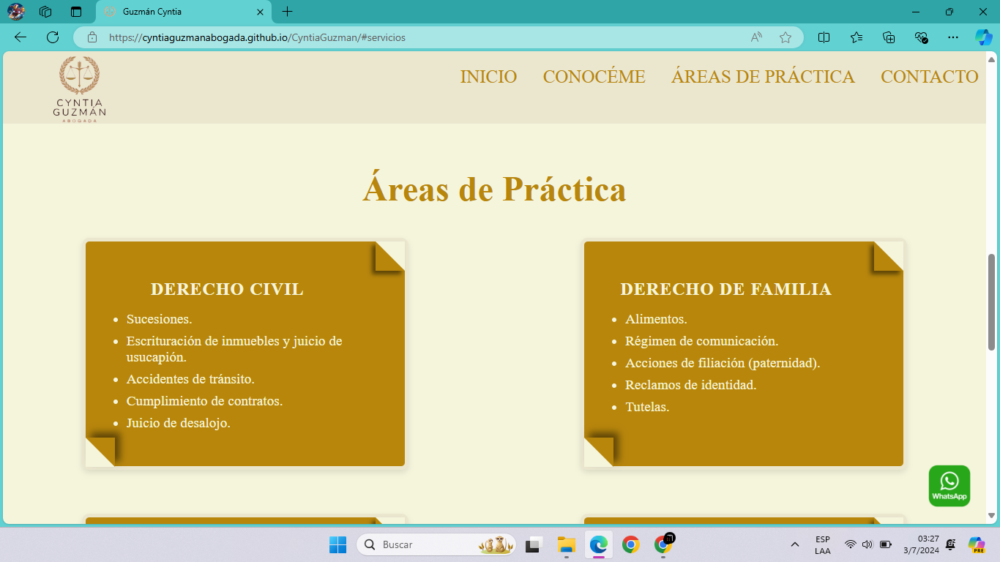
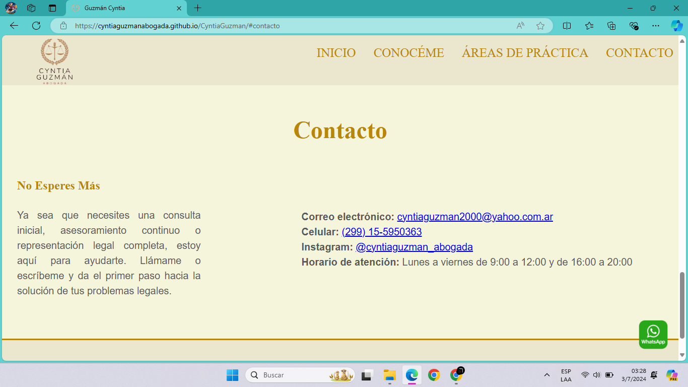
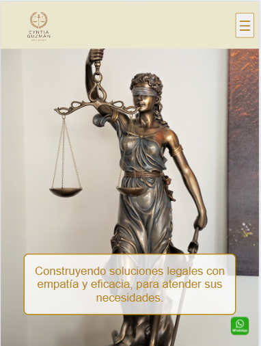
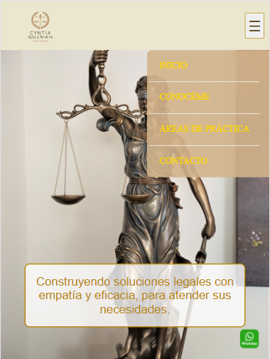
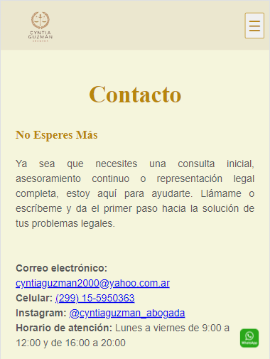

# Web Abogada
Este proyecto consiste en una web estática desarrollada con HTML y CSS. La web proporciona información profesional sobre una abogada. Está alojada en GitHub Pages para facilitar su acceso y visualización. Puedes visitarla en:[Cyntia Guzmán Abogada.](https://cyntiaguzmanabogada.github.io/CyntiaGuzman/)


## Índice
1. [Descripción](#descripción)
2. [Capturas de pantalla](#Capturas-de-pantalla)
3. [Instalación](#instalación)
4. [Uso](#uso)
5. [Características](#características)
6. [Licencia](#licencia)


## Descripción:
<div style="text-align: justify;">
Esta web estática está diseñada para una abogada, con el objetivo de proporcionar una plataforma profesional donde los clientes potenciales puedan conocer más sobre su experiencia y servicios. La web incluye secciones detalladas sobre su biografía, áreas de especialización, una forma de contacto y un botón flotante de WhatsApp para facilitar la comunicación inmediata. Su diseño responsivo garantiza una buena visualización en dispositivos móviles y de escritorio. En la sección de contacto, hay accesos a las redes sociales de la profesional y, si se accede desde un celular, al hacer clic sobre su número de teléfono, se puede llamar directamente sin necesidad de agendar el número.
</div>


## Capturas de pantalla
<div style="text-align: justify;">
A continuación, se presentan las capturas de pantalla de la web en dos tamaños de pantalla diferentes: 1024px y un máximo de 768px. Estas imágenes ilustran cómo se ve el sitio en distintos dispositivos y resoluciones, lo que permite evaluar la adaptabilidad y la experiencia de usuario en diferentes entornos.
</div>

### Pantalla de 1024px
Estas capturas muestran el diseño y la funcionalidad del sitio web en una pantalla con una resolución de 1024px, ideal para dispositivos como laptops y algunos monitores de escritorio.









### Pantalla de max-width: 768px
Aquí se pueden ver las capturas de pantalla del sitio web en una resolución máxima de 768px, comúnmente utilizada en tablets y dispositivos móviles.








## Instalación
1. Clona el repositorio:
    ```bash
    git clone https://github.com/MariaLilenGuzman/estudioJuridico.git
    ```
2. Navega al directorio del proyecto:
    ```bash
    cd repositorio
    ```


## Uso
Abre el archivo `index.html` en tu navegador para ver la web estática.


## Características
- Diseño responsivo.
- Uso de HTML5 y CSS3.
- Información detallada sobre los servicios legales ofrecidos.
- Sección de contacto.
- Botón flotante de WhatsApp: Un botón fijo en la parte inferior izquierda de la pantalla que permite a los usuarios enviar mensajes directamente a través de WhatsApp.
- Enlaces directos a las redes sociales y correo electrónico de la profesional.
-  Al hacer clic sobre el número de teléfono desde un celular, se puede llamar directamente.


## Licencia
Este proyecto está bajo la Licencia MIT. Consulta el archivo [LICENSE](./LICENSE) para más detalles.
